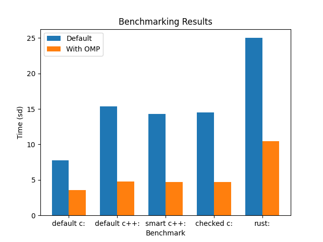

# Fat-Pointers-Benchmarking

The goal of this research is to create normal and fat pointers in the C languages and show the benchmarking difference. By measuring the pace of the different implementations, we can decide if it's reasonable to give up some performance, pace, but get more secureness. By doing microbenchmarking we can measure the time and/or performance of a small building block of a real program. I used default (single thread) and OMP (Open Multiprocessing) benchmarking methods in the research. OMP utilizes multiple threads to speed up the execution by that computations are performed using multiple threads. I used default method as a baseline result to compare OMP execution.


## How To Compile the files

### Default C

- cd to the path of your folder where you cloned the repository

`cd path/to/your/source/directory`

- Compile the c program file using GCC 14

`/usr/local/bin/gcc-14 gcc -O3 default_c.c -fopenmp -o default-c`

- Run the compiled program with the following command

`time ./default_c`

### Compile C++

- cd to the path of your folder where you cloned the repository

`cd path/to/your/source/directory`

- Compile the C++ program file using clang or gcc

`clang++ -O3 code.cpp -Xpreprocessor -fopenmp -I/usr/local/opt/libomp/include -L/usr/local/opt/libomp/lib -lomp -o code`

- Run the compiled program with the following command

`time ./code`

Use the same command for compiling `code.cpp` and `smart.cpp` program. For comparison it is important to use the same compiler.

### Compile Rust

- cd into `src/src/src` folder where `main.rs` is located and run the following command:

`cargo build` and then `cargo run`

This will build the code and run it, so you will be able to see the benchmarking results.

### Checked C

The Dockerfile is already created, so just `cd` into the `src` folder and use the following commands:

- docker build -t checkedc-benchmark . (Build a docker image)

- docker run --rm checkedc-benchmark (start the checked c code)

If you want to start the Docker daemon manually then run the following command: `sudo systemctl start docker`

## Benchmark Result



## Are the Benchmarking codes safe?

I used the `Clang Static Analyzer` tool to ensure the benchmarking codes are free of bugs.

### Here are the results

- Benchmarking in `C`

```text
benedekkaibas@Benedeks-MacBook-Pro src % scan-build clang -fopenmp -L/usr/local/opt/libomp/lib -I/usr/local/opt/libomp/include default_c.c -o default_c
scan-build: Using '/usr/local/Cellar/llvm/19.1.7_1/bin/clang-19' for static analysis
scan-build: Analysis run complete.
scan-build: Removing directory '/var/folders/g2/5kn8dryj619gk260gdvfrh1c0000gn/T/scan-build-2025-02-26-172131-7433-1' because it contains no reports.
scan-build: No bugs found.
```

- Benchmarking `Checked C`

```text
benedekkaibas@Benedeks-MacBook-Pro src % scan-build clang -fopenmp -L/usr/local/opt/libomp/lib -I/usr/local/opt/libomp/include checked_c.c -o checked_c
scan-build: Using '/usr/local/Cellar/llvm/19.1.7_1/bin/clang-19' for static analysis
scan-build: Analysis run complete.
scan-build: Removing directory '/var/folders/g2/5kn8dryj619gk260gdvfrh1c0000gn/T/scan-build-2025-02-26-172131-7433-1' because it contains no reports.
scan-build: No bugs found.
```

- Benchmarking `C++`

```text
benedekkaibas@Benedeks-MacBook-Pro src % scan-build clang -fopenmp -L/usr/local/opt/libomp/lib -I/usr/local/opt/libomp/include code.cpp -o default_cpp
scan-build: Using '/usr/local/Cellar/llvm/19.1.7_1/bin/clang-19' for static analysis
scan-build: Analysis run complete.
scan-build: Removing directory '/var/folders/g2/5kn8dryj619gk260gdvfrh1c0000gn/T/scan-build-2025-02-26-173024-7670-1' because it contains no reports.
scan-build: No bugs found.
```

- Benchmarking `C++ using Smart Pointers`

```text
benedekkaibas@Benedeks-MacBook-Pro src % scan-build clang++ -std=c++11 -stdlib=libc++ -fopenmp -L/usr/local/opt/libomp/lib -I/usr/local/opt/libomp/include smart.cpp -o smart
scan-build: Using '/usr/local/Cellar/llvm/19.1.7_1/bin/clang-19' for static analysis
scan-build: Analysis run complete.
scan-build: Removing directory '/var/folders/g2/5kn8dryj619gk260gdvfrh1c0000gn/T/scan-build-2025-02-26-173645-8397-1' because it contains no reports.
scan-build: No bugs found.
```

**NOTE**: You have to replace to commands to your actual path if you want to run the Static Analyzer!
